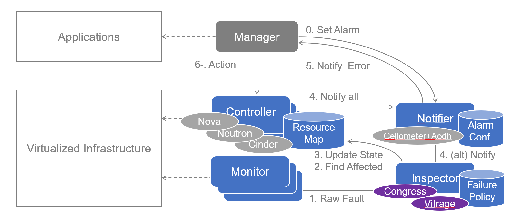

# Smart Inspector 
This is our OPNFV doctor project experimental configuration tutorials


We use zabbix as our Monitor, openstack congress as Inspector.


## 0 OPNFV Deployment

### 00 Deployment via Apex 

```shell
# on our real server 192.168.32.20,E7 with 512G ram
screen -S apex_deploy_screen
opnfv-clean
cd /etc/opnfv-apex 
# in screen apex_deploy_screen
opnfv-deploy -v --virtual-cpus 8 \
    --virtual-default-ram 64 --virtual-compute-ram 96 \
    -n network_settings.yaml -d os-nosdn-nofeature-ha.yaml --debug > apex.log
```

### 01 NAT (discard)

If you openstack external network is not on the same network with your Jumphost (your real HW server),in order to make your external network have Internet access, NAT is necessary to forward your oepnstack external network out

```shell
# on HW server
## allow forward
sysctl net.ipv4.ip_forward=1
#iptables -t nat -A POSTROUTING -s your_openstack_external_network_ip/netmask -j SNAT --to your_HW_network_ip
# example:
iptables -t nat -A POSTROUTING -s 192.168.122.0/24 -j SNAT --to 192.168.32.20
iptables -A FORWARD -m state --state ESTABLISHED,RELATED -j ACCEPT
```

### 02 Dashboard (discard)

To visit dashboard behind NAT from your local browser.

```shell
# on HW server
screen -S opnfv_dashboard
# your can find proper ip address in your overcloudrc file
socat tcp-l:10001,reuseaddr,fork tcp:192.168.37.18:80
# press ctrl-a d to detatch from current screen
## the firewalld may block some connections
service firewalld stop
```

## 1 OpenStack Live Migration Configurations

> See https://docs.openstack.org/nova/latest/admin/configuring-migrations.html for details.  
> See http://www.danplanet.com/blog/2016/03/03/evacuate-in-nova-one-command-to-confuse-us-all/ for more descriptions.

### 10 Ping

Ensure all the compute nodes and controller nodes are able to `ping` each other by the hostname successfully. By default `/etc/hosts` has recorded all the maps needed. Your mission is just ensuring that.

### 11 VNC

Ensure these entries below exist in `/etc/nova/nova.conf` on all the nodes.

```shell
vncserver_proxyclient_address=127.0.0.1
vncserver_listen=0.0.0.0
```

### 12 NFS Server

Install&configure NFS server on one controller.

```shell
# on the controller
# mkdir -p /var/lib/nova/instances/

vim /etc/exports
# append things below
/var/lib/nova/instances  192.0.2.0/24(rw,sync,no_root_squash,insecure)
# 192.0.2.0/24 is the network of compute/controller nodes

exportfs -rv
chmod o+x /var/lib/nova/instances

vim /etc/idmapd.conf
# ensure things below exist
[Mapping]
Nobody-User = nobody
Nobody-Group = nogroup

# configure libvirt
vim /etc/libvirt/libvirtd.conf
# ensure things below
listen_tls = 0
listen_tcp = 1
auth_tcp = "none"
unix_sock_group = "libvirtd"
unix_sock_ro_perms = "0777"
unix_sock_rw_perms = "0770"
auth_unix_ro = "none"
auth_unix_rw = "none"

# configure qemu
vim /etc/libvirt/qemu.conf
# ensure things below
vnc_listen = "0.0.0.0"
user = "root"
group = "root"
dynamic_ownership = 0

systemctl restart rpcidmapd.service
systemctl restart nfs-server.service
```

### 13 NFS Client

Install&client NFS client on each compute node.

```shell
# on each compute node
sudo -i
yum install nfs-utils

# 192.0.2.5 is IP of the controller where NFS server has been installed
mount 192.0.2.5:/var/lib/nova/instances /var/lib/nova/instances

vim /etc/fstab
# configure auto-mount when startup
192.0.2.5:/var/lib/nova/instances /var/lib/nova/instances nfs defaults 0 0

mount -a -v

# to check whether mount succeeds
df -k

ls -ld /var/lib/nova/instances
chmod 777 /var/lib/nova/instances

# configure libvirt
vim /etc/libvirt/libvirtd.conf
# ensure things below
listen_tls = 0
listen_tcp = 1
auth_tcp = "none"
unix_sock_group = "libvirtd"
unix_sock_ro_perms = "0777"
unix_sock_rw_perms = "0770"
auth_unix_ro = "none"
auth_unix_rw = "none"

# configure qemu
vim /etc/libvirt/qemu.conf
# ensure things below
vnc_listen = "0.0.0.0"
user = "root"
group = "root"
dynamic_ownership = 0

usermod nova -a -G libvirt

vim /etc/sysconfig/libvirtd
# ensure things below
LIBVIRTD_ARGS="--listen"

vim /etc/nova/nova.conf
# append statement below to [libvirt]
live_migration_flag=VIR_MIGRATE_UNDEFINE_SOURCE,VIR_MIGRATE_PEER2PEER,VIR_MIGRATE_LIVE,VIR_MIGRATE_TUNNELLED

systemctl restart libvirtd.service
systemctl restart openstack-nova-compute
```

### 14 iptables

```
# on the controller node (which holds the NFS server)
# configure iptables
iptables -A INPUT -p tcp -m multiport --ports 16509 \
    -m comment --comment "libvirt" -j ACCEPT
```

### 15 UID/GID

Check UID/GID on the controller.
You can see the numberic value of UID and GID
```shell
id nova
```
Then sync it on each compute node.
```shell
usermod -u NUMBERICAL_UID 
groupmod -g NUMBERICAL_GID 
```

### 16 Evacuation&Migration

```shell
# just some common commands
nova list
nova show INSTANCE_ID
nova service-list
nova live-migration
nova evacuate
```

## 2 Doctor Configuration

### 20 Monitor
We use Zabbix as our monitor 
#### 200 Zabbix Server Configuration

On one controller node (One is enough):

##### 2000 install Zabbix Server

```shell
# install
sudo rpm -ivh http://repo.zabbix.com/zabbix/3.0/rhel/7/x86_64/zabbix-release-3.0-1.el7.noarch.rpm
sudo yum install zabbix-server-mysql zabbix-web-mysql
sudo yum install zabbix-agent # to monitor itself
```

##### 2001 Config Database for Zabbix Server 
Firstly make sure you MySQL service is running
```shell
sudo systemctl enable mariadb
sudo systemctl start mariadb
```
Create database for Zabbix server
```shell
# SQL instructions
## create database
create database zabbix character set utf8;
## create user and grant privileges
grant all privileges on zabbix.* to zabbix@localhost identified by 'your_password';
flush privileges;

# import schema
cd /usr/share/doc/zabbix-server-mysql-3.0.4/
zcat create.sql.gz | mysql -uzabbix -pzabbix
sudo vi /etc/zabbix/zabbix_server.conf
# configure the password of database
DBPassword=...
```

##### 2002 Httpd 

```shell
sudo vi /etc/httpd/conf.d/zabbix.conf
# modify things below
php_value date.timezone Asia/Shanghai

sudo systemctl restart httpd
sudo systemctl start zabbix-server
sudo systemctl status zabbix-server
sudo systemctl enable zabbix-server
```

##### 2003 Zabbix Web UI

Forwarding controller ip where your Zabbix server is installed may be necessary to access zabbix web ui on your local browser because controller ip is not on the same network with your Jumphost

##### 2004 Zabbix Add Host To Be Monitored

In Web UI:

```
Configuration 
    -> Hosts -> Create host -> Configure host name/host ip
        -> Select host group (by default Linux Server group)
Templates -> Template OS Linux -> Encryption -> PSK
    -> Configure PSK ID (use the ID in part 100)
    -> Configure PSK value (from /etc/zabbix/zabbix_agentd.psk in zabbix agent)
```

##### 2005 Add Item/Trigger/Action

```
Configure Item -> Trigger -> Action
```

##### 2006 Alert Script

> See https://github.com/openstack/congress/blob/master/congress/datasources/doctor_driver.py for details about doctor driver.  
> See https://www.zabbix.com/documentation/3.2/manual/config/notifications/media/script for Zabbix details about alert script.  
> See `man curl` for bonus :)

```shell
# Doctor driver API
PUT /v1/data‐sources/doctor/tables/events/rows
```

1. curl KeyStone RESTful API using HTTP POST for token
2. curl Congress RESTful API using the token above

`alert.sh` sample:

```shell
#!/bin/bash

username="admin"
password="4MbCBXaqHJmARqpWzFNJFQF2T"
congress_url="http://192.168.32.161:1789"
keystone_url="http://192.168.32.161:5000/v2.0"
# fetch token
curl $keystone_url"/tokens" -X POST -H "Content-Type: application/json" -H "Accept: application/json"  -d '{"auth": {"tenantName": "admin", "passwordCredentials": {"username": "admin", "password": "4MbCBXaqHJmARqpWzFNJFQF2T"}}}' > result.json

token0=$(jq .access.token.id result.json)

token=${token0//\"/}

rm result.json

sendtime=`date`

# send data
curl -i -X PUT $congress_url/v1/data-sources/doctor/tables/events/rows -H "Content-Type: application/json" -d '[{"time":"2016-02-22T11:48:55Z","type":"compute.host.down","details":{"hostname":"overcloud-novacompute-0.opnfvlf.org","status":"down","monitor":"zabbix1","monitor_event_id":"111"}}]'  -H "X-Auth-Token: $token"
```

Then

```shell
chown zabbix.zabbix /usr/local/zabbix/share/zabbix/alertscripts/alertscript.sh
chmod +x /usr/local/zabbix/share/zabbix/alertscripts/alertscript.sh
```

##### 2007 Add Media
Configuration in zabbix web ui
```
Administration -> Add Media Types -> Select script type -> add alert.sh into AlertScriptsPath
```
#### 201 Zabbix Agent Configuration

On each compute node:

```shell
# install
sudo rpm -ivh http://repo.zabbix.com/zabbix/3.0/rhel/7/x86_64/zabbix-release-3.0-1.el7.noarch.rpm
sudo yum install zabbix-agent

# PSK encryption
sudo sh -c "openssl rand -hex 32 > /etc/zabbix/zabbix_agentd.psk"
## content of this file may be needed in zabbix web ui configuration
cat /etc/zabbix/zabbix_agentd.psk

sudo vi /etc/zabbix/zabbix_agentd.conf
## configure zabbix server
Server= your zabbix server ip
## configure connection between server and agent
TLSConnect=psk
TLSAccept=psk
TLSPSKIdentity=PSK 001
## when you add host in zabbix web agent, you should use this PSK ID
TLSPSKFile=/etc/zabbix/zabbix_agentd.psk

# start agent
sudo systemctl start zabbix-agent
sudo systemctl enable zabbix-agent
## check status
sudo systemctl status zabbix-agent
```


### 21 Inspector

We use openstack congress as our Inspector
> See http://docs.opnfv.org/en/stable-danube/submodules/doctor/docs/release/configguide/feature.configuration.html#doctor-inspector for details.

#### 210 Add Congress Datasource Driver
```shell
ssh heat-admin@192.0.2.x # log to all of your controller via ssh
sudo -i
vim /etc/congress/congress.conf
# add doctor driver to Congress
# configuration should be done on all controller node
# then find the `drivers=...` entry
# append `congress.datasources.doctor_driver.DoctorDriver` to it
service openstack‐congress‐server restart
```
#### 211 Create Congress Policy Rule

> See https://docs.openstack.org/congress/latest/user/policy.html for details about policy.

> See http://docs.opnfv.org/en/stable-danube/submodules/doctor/docs/release/configguide/feature.configuration.html for details
```shell
source overcloudrc
openstack congress datasource create doctor doctor
```

Create policies needed

```shell
openstack congress policy rule create \
    --name host_down classification \
    'host_down(host) :-
        doctor:events(hostname=host, type="compute.host.down", status="down")'

openstack congress policy rule create \
    --name active_instance_in_host classification \
    'active_instance_in_host(vmid, host) :-
        nova:servers(id=vmid, host_name=host, status="ACTIVE")'

openstack congress policy rule create \
    --name host_force_down classification \
    'execute[nova:services.force_down(host, "nova-compute", "True")] :-
        host_down(host)'

openstack congress policy rule create \
    --name error_vm_states classification \
    'execute[nova:servers.reset_state(vmid, "error")] :-
        host_down(host),
        active_instance_in_host(vmid, host)'
```
Change VM status to pause instead of error for live-migration policy
```shell
openstack congress policy rule create \
    --name pause_vm_states classification \
    'execute[nova:servers.pause(vmid)] :-
        host_down(host),
        active_instance_in_host(vmid, host)'
```
You should also change alarm rule query sentence
### 22 Notification Configuration 

> See https://docs.openstack.org/newton/config-reference/compute/config-options.html, https://docs.openstack.org/nova/14.0.7/notifications.html for details about Nova notify_on_state_change conguration.  
> See https://docs.openstack.org/newton/config-reference/telemetry/samples/event_definitions.yaml.html for details about Ceilometer.  
> See https://docs.openstack.org/aodh/latest/contributor/event-alarm.html, https://docs.openstack.org/aodh/latest/admin/telemetry-alarms.html#event-based-alarm, https://github.com/openstack/aodh/blob/master/aodh/notifier/rest.py for details about Aodh.
> See https://lingxiankong.github.io/2017-07-04-ceilometer-notification.html for details about notification
Usually, configuration should be done in all controller nodes 
```shell
ssh heat-admin@192.0.2.x # ssh onto every controller
sudo -i # root necessary for operations later
```

#### 220 Nova

```shell
# vim /etc/nova/nova.conf

# ensure entries below,those should exist by default
notify_on_state_change=vm_and_task_state

[oslo_messaging_notifications]
driver=messagingv2
# add topic
topics=notifications
```

#### 221 Ceilometer

------event-------> ceilometer -----publish/notifier-------->

```shell
vim /etc/ceilometer/event_pipeline.yaml

# add publishers "notifier://?topic=alarm.all"
‐‐‐
sources:
    ‐ name: event_source
        events:
            ‐ "*"
        sinks:
            ‐ event_sink
sinks:
    ‐ name: event_sink
        transformers:
        publishers:
            ‐ notifier://
            ‐ notifier://?topic=alarm.all
```

add topic to ceilometer publish notifier
```shell
# vim /etc/ceilometer/ceilometer.conf
[publisher_notifier]
event_topic=event
```
restart ceilometer
```shell
# restart ceilometer
service openstack-ceilometer-notification restart
service openstack-ceilometer-central restart
```

#### 222 Aodh(Create Alarm)

```shell
# configurations
vim /etc/aodh/aodh.conf

# by default the configurations are right; just ensure it
# aodh will listen to the topic specified
[listener]
event_alarm_topic = alarm.all
```

```shell
# restart aodh
service openstack-aodh-listener restart
service openstack-aodh-notifier restart
```

```shell
# create alarm rule
aodh alarm create \
    ‐‐name test_alarm \
    ‐‐type event \
    ‐‐alarm‐action "http://127.0.0.1:12346/failure" \
    ‐‐repeat‐actions false \
    ‐‐event‐type compute.instance.update \
    ‐‐query "traits.state=string::error"
```
If any syntax error occurs, use the following command
```shell
aodh alarm create --name test_alarm --type event --alarm-action "http://127.0.0.1:12346/" --repeat-actions false --event-type compute.instance.update --query "traits.state=string::error"
```

(If you use `consumer.py` in doctor tests it will listen at `12346` port. See http://docs.opnfv.org/en/stable-danube/submodules/doctor/docs/release/userguide/feature.userguide.html#immediate-notification for details.)

```shell
# to disable an alarm rule
aodh alarm update ‐‐enabled False ALARM_ID
# to delete an alarm rule
aodh alarm delete ALARM_ID
```

### 23 Application Manager

Application Manager send request to Nova to migrate VMs when something wrong inspected 

#### 230 Source Code

```python
#!/usr/bin/env python
# modify app route if necessary
import argparse
from flask import Flask
from flask import request
import json
import os
import time

app = Flask(__name__)

@app.route('/failure', methods=['POST'])
def event_posted():
    LOG.info('application manager notified at %s' % time.time())
    LOG.info('received data = %s' % request.data)
    d = json.loads(request.data)
    return "OK"


def get_args():
    parser = argparse.ArgumentParser(description='Doctor Sample Consumer')
    parser.add_argument('port', metavar='PORT', type=int, nargs='?',
                        help='the port for consumer')
    return parser.parse_args()


def main():
    args = get_args()
    app.run(host="0.0.0.0", port=args.port)


if __name__ == '__main__':
    main()
```
## 3 Pre-configuration For Cloudify&Clearwater Deployment 

Before running the script, you need to put all the images you need in `~/images`. You could upload these files from your Jumphost or you could download them on your stack VM. Currently we put four cloud image files in the folder:

- CentOS-7-x86_64-GenericCloud.qcow2
- precise-server-cloudimg-amd64-disk1.img
- trusty-server-cloudimg-amd64-disk1.img
- xenial-server-cloudimg-amd64-disk1.img

```shell
# inport some environment variable
source ./overcloudrc

# openstack create images
for image in $( ls ./images ); do
        glance image-create --name $image --file images/$image \
            --disk-format qcow2 --container-format bare --progress
done

# add flavor for oepnstack
nova flavor-create --ephemeral 0 --is-public True m1.tiny 1 1024 10 1
nova flavor-create --ephemeral 0 --is-public True m1.small 2 2048 20 1
nova flavor-create --ephemeral 0 --is-public True m1.medium 3 4096 40 2
nova flavor-create --ephemeral 0 --is-public True m1.large 4 8192 80 4

# add key pair
nova keypair-add newbie_test > newbie_test.pem
## change the attribute or `ssh` will fail
chmod 700 ./newbie_test.pem

# create network
neutron net-create test_hou
neutron subnet-create test_hou 192.168.22.0/24 --name test_hou_sub --dns-nameserver 8.8.8.8

# add router
neutron router-create router_test_hou
router_id=$(openstack router list | grep router_test_hou | cut -d'|' -f 2)
external_network_id=$(openstack network list | grep external | cut -d'|' -f 2)
hou_subnet_id=$(openstack network list | grep test_hou | cut -d'|' -f 4)
neutron router-gateway-set $router_id $external_network_id
neutron router-interface-add $router_id $hou_subnet_id
neutron port-create test_hou

# create instance of Ubuntu 14.04
instance_img_id=$(openstack image list | grep trusty | cut -d'|' -f 2)
nova boot --flavor 2 --image $instance_img_id \
    --key-name newbie_test --security-groups default \
    --description "newbie_test" test_zhian

# create floating ip for your VM
openstack floating ip create --floating-ip-address 192.168.37.200 external
nova floating-ip-associate test_zhian 192.168.37.200

# modify security group
sec_grp_prj=$(openstack project list | grep admin | cut -d'|' -f 2)
sec_grp_id=$(openstack security group list | grep $sec_grp_prj | grep default | cut -d'|' -f 2)
## allow ssh
openstack security group rule create  $sec_grp_id --protocol tcp --dst-port 22:22 --src-ip 0.0.0.0/0
## allow ping
openstack security group rule create --protocol icmp $sec_grp_id
## allow any
nova secgroup-add-rule $sec_grp_id tcp 1 65535 0.0.0.0/0

# create ssh login file
ssh-keygen -R 192.168.37.200
echo  '#!/bin/bash' > newbie.sh
echo -e "\n" >> newbie.sh
echo "ssh -i ./newbie_test.pem ubuntu@192.168.37.200" >> newbie.sh
chmod +x ./newbie.sh
```

After creating the instance, you can simply run `./newbie.sh` to log on it.

## 4 Cloudify&Clearwater Deployment

Before deploying Cloudify, you need to change openstack default quotas.

The easiest way to do this is via ansible since you need to do the same modification in all three controller nodes in our deployment, ansible commands looks like this
```shell
 ansible controller -m script -a 'change_security_group_quota.sh' --sudo
```

```shell
# increase limit of the number of security group
## on controller (all controllers)
vim /etc/neutron/neutron.conf
### change security group to 50
### change security group rules to 500
service neutron-server restart

# increase limit of the number of instances
source overcloudrc
openstack quota set admin --instances 30

# increase limit of the number of CPU
openstack quota set admin --cores 30
```

### 40 Cloudify Client

Create one Ubuntu 14.04 instance (Actually, script in `3 Instance Creation` has already done this for you).

```shell
cd ~
# install virtualenv
sudo apt-get update
sudo apt-get install git python-pip python-dev python-virtualenv -y
virtualenv cloudify
source cloudify/bin/activate

# install cloudify
cd cloudify
pip install cloudify==3.3.1
```

### 41 Cloudify Manager

Bootstrap cloudify manager.

```shell
mkdir -p cloudify-manager
cd cloudify-manager
git clone -b 3.3.1-build  https://github.com/boucherv-orange/cloudify-manager-blueprints.git

# initialize cfy work environment (initializes CLI configuration files)
cfy init
cd cloudify-manager-blueprints/
cfy local create-requirements -o requirements.txt -p openstack-manager-blueprint.yaml
sudo pip install -r requirements.txt

# specify your own openstack information
vi openstack-manager-blueprint-inputs.yaml

# bootstrap manager
cfy bootstrap --install-plugins -p openstack-manager-blueprint.yaml -i openstack-manager-blueprint-inputs.yaml
```

### 42 Clearwater

#### Deploy clearwater via cloudify.

```shell
# Prepare clearwater blueprints
cd ~/cloudify/cloudify-manager/
mkdir blueprints
cd blueprints
git clone -b stable https://github.com/Orange-OpenSource/opnfv-cloudify-clearwater.git

# Upload clearwater blueprints
cd opnfv-cloudify-clearwater
cfy blueprints upload -b clearwater-3.3 -p openstack-blueprint.yaml

# create deployment
cp inputs/openstack.yaml.template inputs/inputs.yaml
# provide proper configuration 
vim inputs/inputs.yaml 
cfy deployments create -b clearwater-3.3 -d clearwater-test --inputs inputs/inputs.yaml
cfy executions start -w install -d clearwater-test
```

You can also create and launch deployment via cloudify Web UI, just fill in proper information needed by deploying then start installation workflow.


Note that the specified version must be satisfied otherwise the process might not work.

#### Run the clearwater-live-test 

```shell
rake test[clearwater.opnfv] SIGNUP_CODE=secret ELLIS=192.168.32.208 PROXY=192.168.32.202 GEMINI=10.67.79.15 MEMENTO_SIP=10.67.79.15  MOMENTO_HTTP=10.67.79.15 ELLIS_API_KEY=secret
```

## 5 Make Your First Call 
> See http://clearwater.readthedocs.io/en/stable/Making_your_first_call.html#making-calls-through-clearwater for details.

Our communication system is 

```
Blink <-> Clearwater <-> Blink
```

You can download `Blink` from http://icanblink.com/download/.

```
Information needed:

- base DNS name: opnfv.clearwater (as <domain>)
- Ellis URL: use IP
- sign up as a new user using the signup code("secret")
- then take down the number(as <username>) and the password(as <password>)

Configuration on SIP Client (Blink):

SIP Username       | <username>
SIP Password       | <password>
SIP domain         | <domain>
Authorization Name | <username>@<domain>
Transport          | TCP
STUN/TURN/ICE      |
    Enabled        | true
    Server         | <domain>
    username       | <username>@<domain>
    Password       | <password>
    Use rport      | true (this is required if your SIP client is behind a NAT)
```
Issues:
- Connection lost after 15 seconds due to 'No ack received'
- Both X-lite and Blink could not register successfully via TCP on one of our windows virtual machine, strangely on another windows virtual machine registering via tcp works properly

## 6 Doctor Tests

> See http://docs.opnfv.org/en/stable-danube/submodules/doctor/docs/development/overview/testing.html, https://wiki.opnfv.org/display/functest/ for details.

```shell
# on real server

## test script
git clone https://gerrit.opnfv.org/gerrit/doctor
cd doctor/tests
export INSTALLER_TYPE=apex
export INSPECTOR_TYPE=sample
./run.sh

## functest
DOCKER_TAG=latest
docker pull opnfv/functest:${DOCKER_TAG}
docker run --privileged=true -id \
    -e INSTALLER_TYPE=${INSTALLER_TYPE} \
    -e INSTALLER_IP=${INSTALLER_IP} \
    -e INSPECTOR_TYPE=sample \
    opnfv/functest:${DOCKER_TAG} /bin/bash
docker exec <container_id> python /home/opnfv/repos/functest/functest/ci/prepare_env.py start
docker exec <container_id> functest testcase run doctor
```
## 7 Summary

To be or not to be, that is a question :)

## 8 Extras

### 80 Nova Service Force Down

```shell
# unset `down`
nova service‐force‐down ‐‐unset overcloud‐novacompute‐2.opnfvlf.org nova-compute
# set `down`
nova service‐force‐down ‐‐set overcloud‐novacompute‐2.opnfvlf.org nova‐compute
```

### 81 Reset Instance's State

```shell
nova reset-state --active INSTANCE_ID
```

### 82 Migrate&Evacuate Commands

```shell
# Migrate a server. The new host will be selected by the scheduler
nova migrate
# Evacuate server from failed host
nova host-evacuate
# Migrate running server to a new machine
nova live-migration
# Live migrate all instances of the specified host to other available hosts
nova host-evacuate-live
# Cold migrate all instances off the specified host to other available hosts
nova host-servers-migrate
```

### 83 Sync Configurations

Modifications to the configruations on one controller should be applied to all the other controllers, so it is with compute nodes.

### 84 Yardstick Test

```shell
## wiki
### https://wiki.opnfv.org/display/yardstick
## download & run
docker pull opnfv/yardstick:latest
docker run ‐itd ‐‐privileged ‐v /var/run/docker.sock:/var/run/docker.sock \
    ‐‐name yardstick opnfv/yardstick:latest
## interactive bash
docker exec ‐it yardstick bash
## test prepare
yardstick env prepare
## add identification
### copy identification from undercloud /home/stack/overcloudrc
vim /etc/yardstick/openstack.creds
### use identification
source /etc/yardstick/openstack.creds
## run samples
yardstick ‐d task start samples/ping.yaml
## watch report
cat /tmp/yardstick.out
## delete yardstick
docker stop yardstick && docker rm yardstick
```

### 85 Functest Test

```shell
## wiki
### https://wiki.opnfv.org/display/functest
## download & run
docker pull opnfv/functest:latest
docker run ‐itd ‐‐privileged ‐v /var/run/docker.sock:/var/run/docker.sock ‐‐
name functest opnfv/functest:latest
## interactive bash
docker exec ‐it functest bash
## download images
download_images.sh /home/opnfv/functest/images/
## add identification
### copy identification from undercloud /home/stack/overcloudrc
vim /home/opnfv/functest/conf/openstack.creds
## test prepare
functest env prepare
### use identification
source /home/opnfv/functest/conf/openstack.creds
## show test tier
functest tier list
## run test
functest testcase run connection_check
functest testcase run vping_ssh
```

### 86 Other Notes

```shell
# goto undercloud
opnfv-util undercloud
# show containers
docker ps
# show images
docker images
# add SSH key to container
docker cp /root/.ssh/id_rsa CONTAINER_ID:/root/.ssh/id_rsa
# use screen 
## create a screen (name: inspector)
screen ‐S inspector
## detach from current screen, back to bash
Ctrl+A d
## list screen
screen ‐ls
## recovery (xxx is the ID of screen)
screen ‐r xxx
# cloudify CLI3.3.3 commonly used 
## destroy cloudify manager environment
cfy teardown -f
## delete deployment via CLI 
cfy deployments delete -d DEPLOYMENT_ID
```

### 87 Error

#### 870 Error When Deploying Cloudify
May be caused by openstack internal internet problem
```
[192.168.32.195] run: curl --fail -XPOST localhost:8101/api/v2/provider/context?update=False -H "Content-Type: application/json" -d @/tmp/provider-context.json
[192.168.32.195] out: curl: (22) The requested URL returned error: 500 INTERNAL SERVER ERROR
[192.168.32.195] out: 


Fatal error: run() received nonzero return code 22 while executing!

Requested: curl --fail -XPOST localhost:8101/api/v2/provider/context?update=False -H "Content-Type: application/json" -d @/tmp/provider-context.json
Executed: /bin/bash -l -c "curl --fail -XPOST localhost:8101/api/v2/provider/context?update=False -H \"Content-Type: application/json\" -d @/tmp/provider-context.json"

Aborting.
```

https://github.com/cloudify-cosmo/cloudify-manager-blueprints/issues/136
https://groups.google.com/forum/#!topic/cloudify-users/7Vo2fUVlLks

#### 871 abort-on-prompts Was Set to True
May be caused by ssh user wrong configuration,cloudify CLI machine was trying to ssh to manager machine by ubuntu,default user name should be centos, cloudify default value is centos, no need to change it.

Another issue could cause this problem could be due to openstack internal problem, cloudify CLI successfully bootstrap a manager VM, then associate a floating ip to the VM in order to ssh to VM do some necessary configuration, the floating ip doesn't work properly, cloudify CLI bootstrap process will failed due to time out.
```
2017-08-31 02:46:16 LOG <manager> [java_runtime_31aad.create] ERROR: Exception raised on operation [fabric_plugin.tasks.run_script] invocation
Traceback (most recent call last):
  File "/home/ubuntu/cloudify/local/lib/python2.7/site-packages/cloudify/decorators.py", line 122, in wrapper
    result = func(*args, **kwargs)
  File "/home/ubuntu/cloudify/local/lib/python2.7/site-packages/fabric_plugin/tasks.py", line 152, in run_script
    if not fabric_files.exists(remote_ctx_path):
  File "/home/ubuntu/cloudify/local/lib/python2.7/site-packages/fabric/contrib/files.py", line 36, in exists
    return not func(cmd).failed
  File "/home/ubuntu/cloudify/local/lib/python2.7/site-packages/fabric/network.py", line 639, in host_prompting_wrapper
    return func(*args, **kwargs)
  File "/home/ubuntu/cloudify/local/lib/python2.7/site-packages/fabric/operations.py", line 1042, in run
    shell_escape=shell_escape)
  File "/home/ubuntu/cloudify/local/lib/python2.7/site-packages/fabric/operations.py", line 909, in _run_command
    channel=default_channel(), command=wrapped_command, pty=pty,
  File "/home/ubuntu/cloudify/local/lib/python2.7/site-packages/fabric/state.py", line 388, in default_channel
    chan = _open_session()
  File "/home/ubuntu/cloudify/local/lib/python2.7/site-packages/fabric/state.py", line 380, in _open_session
    return connections[env.host_string].get_transport().open_session()
  File "/home/ubuntu/cloudify/local/lib/python2.7/site-packages/fabric/network.py", line 151, in __getitem__
    self.connect(key)
  File "/home/ubuntu/cloudify/local/lib/python2.7/site-packages/fabric/network.py", line 143, in connect
    self[key] = connect(user, host, port, cache=self)
  File "/home/ubuntu/cloudify/local/lib/python2.7/site-packages/fabric/network.py", line 523, in connect
    password = prompt_for_password(text)
  File "/home/ubuntu/cloudify/local/lib/python2.7/site-packages/fabric/network.py", line 596, in prompt_for_password
    handle_prompt_abort("a connection or sudo password")
  File "/home/ubuntu/cloudify/local/lib/python2.7/site-packages/fabric/utils.py", line 151, in handle_prompt_abort
    abort(reason % "abort-on-prompts was set to True")
  File "/home/ubuntu/cloudify/local/lib/python2.7/site-packages/fabric/utils.py", line 32, in abort
    raise env.abort_exception(msg)
FabricTaskError: Needed to prompt for a connection or sudo password (host: 192.168.32.196), but abort-on-prompts was set to True
2017-08-31 02:46:16 CFY <manager> [java_runtime_31aad.create] Task failed 'fabric_plugin.tasks.run_script' -> Needed to prompt for a connection or sudo password (host: 192.168.32.196), but abort-on-prompts was set to True [attempt 6/6]
2017-08-31 02:46:16 CFY <manager> [influxdb_b9ebb.create] Task started 'fabric_plugin.tasks.run_script' [attempt 6/6]
2017-08-31 02:46:16 LOG <manager> [influxdb_b9ebb.create] INFO: preparing fabric environment...
2017-08-31 02:46:16 LOG <manager> [influxdb_b9ebb.create] INFO: environment prepared successfully
2017-08-31 02:46:16 CFY <manager> 'install' workflow execution failed: Workflow failed: Task failed 'fabric_plugin.tasks.run_script' -> Needed to prompt for a connection or sudo password (host: 192.168.32.196), but abort-on-prompts was set to True
bootstrap failed! (Workflow failed: Task failed 'fabric_plugin.tasks.run_script' -> Needed to prompt for a connection or sudo password (host: 192.168.32.196), but abort-on-prompts was set to True)

Fatal error: Needed to prompt for a connection or sudo password (host: 192.168.32.196), but abort-on-prompts was set to True

Aborting.
```
## Reference
- https://wiki.opnfv.org/display/doctor/Doctor+Home
- http://congress.readthedocs.io/en/latest/
